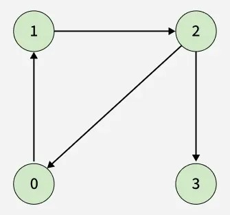
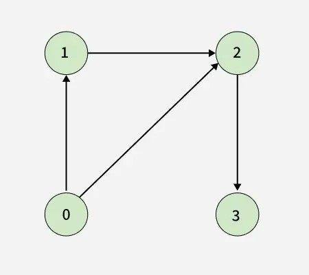

# Detect cycle in a directed graph

- Source: [GeeksforGeeks](https://www.geeksforgeeks.org/problems/detect-cycle-in-a-directed-graph/1)
- Platform: GeeksforGeeks

## Problem Description

Given a directed graph with `V` vertices numbered from `0` to `V - 1` and `E` directed edges. The graph is represented using a 2D array `edges[][]` of size `E`, where each entry `edges[i] = [u, v]` denotes a directed edge from vertex `u` to vertex `v`.

Check whether the graph contains any cycle. Return `true` if there exists at least one cycle in the graph; otherwise, return `false`.

## Examples

### Example 1:
- **Input:** `V = 4, edges[][] = [[0, 1], [1, 2], [2, 0], [2, 3]]`

- **Output:** `true`
- **Explanation:** There is a cycle: `0 -> 1 -> 2 -> 0`.

### Example 2:
- **Input:** `V = 4, edges[][] = [[0, 1], [0, 2], [1, 2], [2, 3]]`

- **Output:** `false`
- **Explanation:** No cycle exists in the graph.

## Constraints

- `1 <= V <= 10^5`
- `0 <= E <= 10^5`
- `0 <= edges[i][0], edges[i][1] < V`
