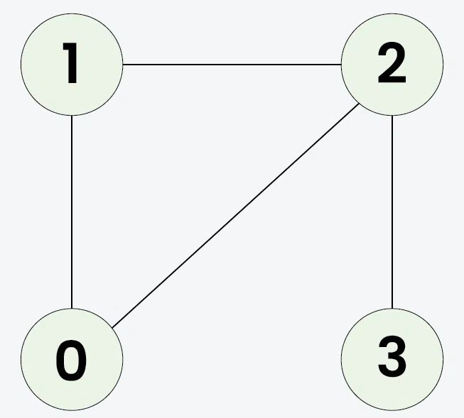
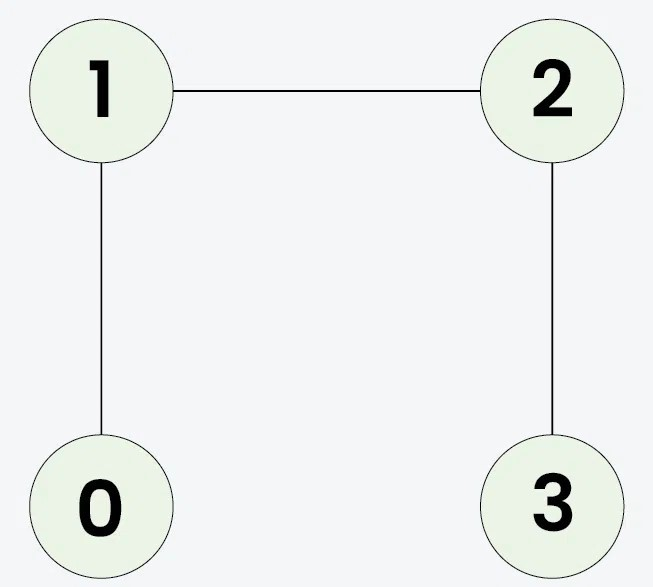

# Detect cycle in an undirected graph

- Source: [GeeksforGeeks](https://www.geeksforgeeks.org/problems/detect-cycle-in-an-undirected-graph/1)
- Platform: GeeksforGeeks

## Problem Description

Given an undirected graph with `V` vertices and `E` edges, represented as a 2D vector `edges[][]`, where each entry `edges[i] = [u, v]` denotes an edge between vertices `u` and `v`, determine whether the graph contains a cycle or not.

> **Note:** The graph can have multiple components.

## Examples

### Example 1:
- **Input:** `V = 4, E = 4, edges[][] = [[0, 1], [0, 2], [1, 2], [2, 3]]`

- **Output:** `true`
- **Explanation:** `1 -> 2 -> 0 -> 1` is a cycle.

### Example 2:
- **Input:** `V = 4, E = 3, edges[][] = [[0, 1], [1, 2], [2, 3]]`

- **Output:** `false`
- **Explanation:** No cycle in the graph.

## Constraints

- `1 <= V, E <= 10^5`
- `0 <= edges[i][0], edges[i][1] < V`
