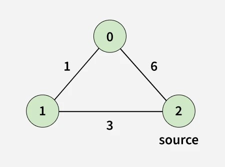
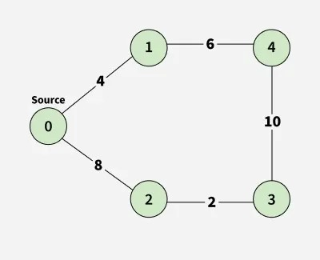

# Dijkstra Algorithm

- Source: [GeeksforGeeks](https://www.geeksforgeeks.org/problems/implementing-dijkstra-set-1-adjacency-matrix/1)
- Platform: GeeksforGeeks

## Problem Description

Given an undirected, weighted graph with `V` vertices numbered from `0` to `V - 1` and `E` edges, represented by 2D array `edges[][]`, where `edges[i] = [u, v, w]` represents the edge between the nodes `u` and `v` having `w` weight.

Find the shortest distance of all the vertices from the source vertex `src`, and return an array of integers where the `i`-th element denotes the shortest distance between `i`-th node and source vertex `src`.

> **Note:** The Graph is connected and doesn't contain any negative weight edge. It is guaranteed that all the shortest distances will fit in a 32-bit integer.

## Examples

### Example 1:
- **Input:** `V = 3, edges[][] = [[0, 1, 1], [1, 2, 3], [0, 2, 6]], src = 2`

- **Output:** `[4, 3, 0]`
- **Explanation:**
  - For `2` to `0`, minimum distance is `4` (`2 -> 1 -> 0`).
  - For `2` to `1`, minimum distance is `3` (`2 -> 1`).
  - For `2` to `2`, minimum distance is `0` (`2 -> 2`).

### Example 2:
- **Input:** `V = 5, edges[][] = [[0, 1, 4], [0, 2, 8], [1, 4, 6], [2, 3, 2], [3, 4, 10]], src = 0`

- **Output:** `[0, 4, 8, 10, 10]`
- **Explanation:**
  - For `0` to `1`, minimum distance is `4` (`0 -> 1`).
  - For `0` to `2`, minimum distance is `8` (`0 -> 2`).
  - For `0` to `3`, minimum distance is `10` (`0 -> 2 -> 3`).
  - For `0` to `4`, minimum distance is `10` (`0 -> 1 -> 4`).

## Constraints

- `1 <= V <= 10^6`
- `1 <= E = edges.size() <= 10^6`
- `0 <= edges[i][0], edges[i][1] <= V - 1`
- `0 <= edges[i][2] <= 10^4`
- `0 <= src < V`
